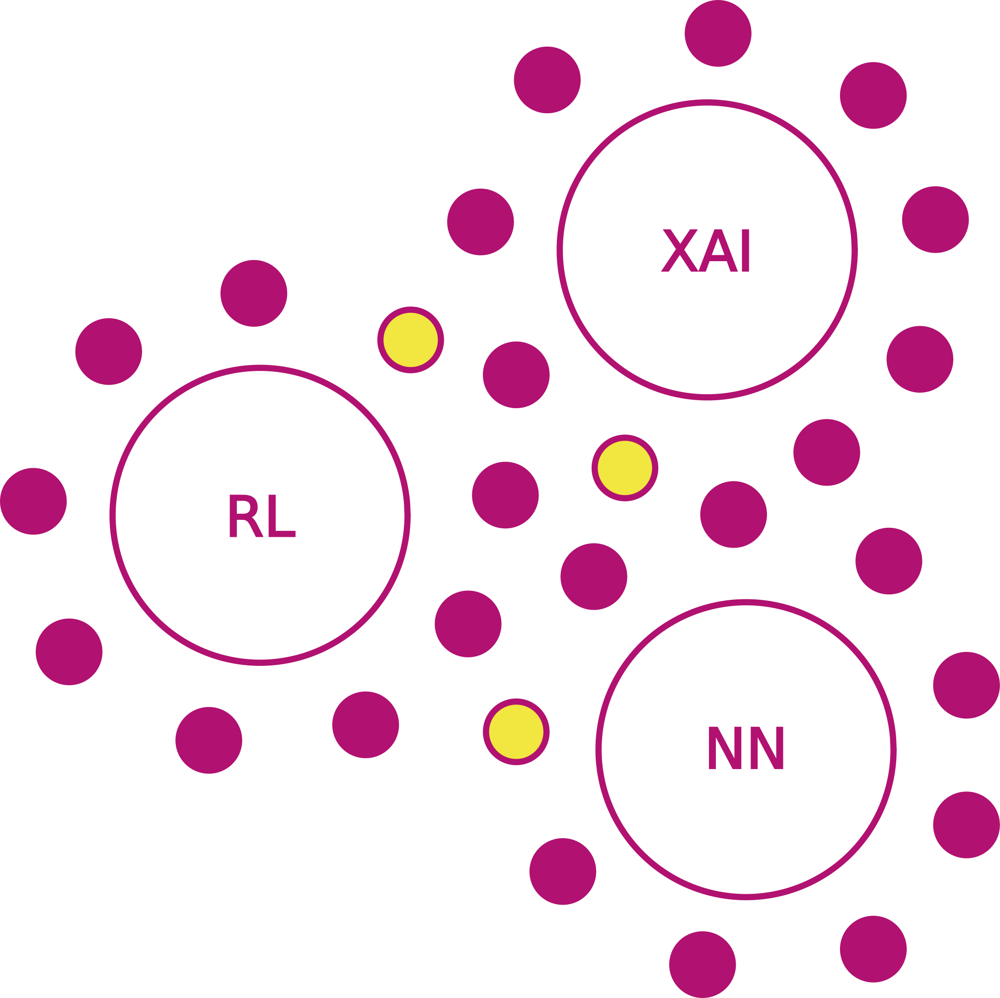

<link rel="stylesheet" href="https://maxcdn.bootstrapcdn.com/font-awesome/4.6.0/css/font-awesome.min.css">

## 
Interactive Program

### Goals: Networking and Collaboration

### Schedule: 09:00-15:00 IDT  ([converter](https://time.is/compare/900_11_Aug_2022_in_IDT/Amsterdam/Melbourne/Los_Angeles/Beijing/New_York){:target="_blank"})

| Time | Type | Activity|
| -------- | :--------: | -------- |
| 09:00 | <i class="fa fa-slideshare fa-fw"></i>  | 60 min keynote|
| 10:30 | <i class="fa fa-coffee fa-fw"></i>  | 30 min break / networking / posters|
| 11:00 | <i class="fa fa-slideshare fa-fw"></i>  | 3x20 min invited talks|
| 12:00 | <i class="fa fa-group fa-fw"></i>  | 30 min round-table discussions|
| 12:30 | <i class="fa fa-cutlery fa-fw"></i>  | 90 min lunch|
| 14:00 | <i class="fa fa-group fa-fw"></i>  | 30 min round-table discussions|
| 14:30 | <i class="fa fa-coffee fa-fw"></i>  | posters / networking|

### Topics & Round-Table Hosts

    
| Topics | Speaker | Role |
|:------------------------------------------------------------------------------------ |:----------------:|:---------------:|:----------:|:-----------:|
| Artificial Intelligence | [Ann Nowé](https://ai.vub.ac.be/team/ann-nowe/){:target="_blank"} | Keynote |
| Safe Reinforcement Learning | [Suguman Bansal](https://suguman.github.io/){:target="_blank"} | Host |
| Explainable Artificial Intelligence | [Hana Chockler](https://www.hanachockler.com/){:target="_blank"} | Host |
| Robustness of Neural Networks| [Dana Drachsler Cohen](https://ddana.net.technion.ac.il/){:target="_blank"} | Host |

### 
Round-Table Discussions  <i class="fa fa-group fa-fw"></i> 

